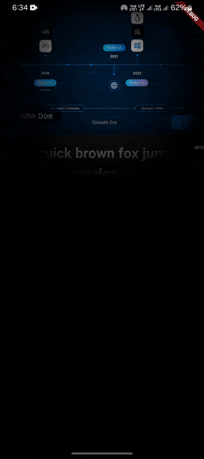

# Spotlight Effect in Flutter

### Usage

``` 
SpotlightEffect(
        child: YourUIWidget(),
    )
```


## Demo of Spotlight Effect in Flutter

adding spotlight effect to a widget in flutter




## Social Links

- [LinkedIn](https://www.linkedin.com/in/codewithprashant)
- [Instagram](https://instagram.com/navokitech)
- [LinkTree](https://linktr.ee/theshivamlko)


This project is a starting point for a Flutter application.

A few resources to get you started if this is your first Flutter project:

- [Lab: Write your first Flutter app](https://docs.flutter.dev/get-started/codelab)
- [Cookbook: Useful Flutter samples](https://docs.flutter.dev/cookbook)

For help getting started with Flutter development, view the
[online documentation](https://docs.flutter.dev/), which offers tutorials,
samples, guidance on mobile development, and a full API reference.
